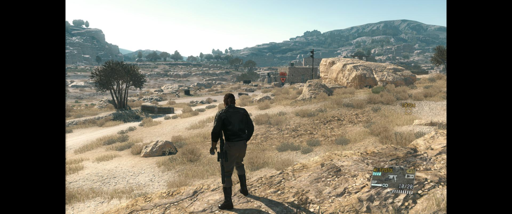

# MGS5Fix

> MGS5Fix is a fork of [MGSVFix](https://github.com/Lyall/MGSVFix) by Lyall.
> It is **not** the original release and is **not** affiliated with, endorsed by, or
> supported by the original creator. Please do **not** send support requests for this
> fork to them — if something here is broken, open an issue on **this** repository.

MGS5Fix is a fork of **MGSVFix**, an ASI plugin for *Metal Gear Solid V: The Phantom Pain* (and *Ground Zeroes*!) that can:

- Skip intro logos and the autosave dialog.
- Unlock the framerate.
- Unlock resolution options/support.
- Fix HUD issues at ultrawide resolutions.
- Fix graphical effects at ultrawide resolutions.
- Tweak LOD distances.
- Change FOV.

For more details on exactly what is fixed, see [fixes.md](./fixes.md).

## Installation
- GitHub: Download the latest [release](../../releases).
- GitLab: Download the latest [release](https://gitgud.io/orochi/mods/mgs5/mgsv-fix/-/releases).
- Extract the contents of the release zip into the game folder.

### Steam Deck / Linux
🚩 **Windows users can skip this step!**
- Open the game's properties in Steam and add the following to the launch options:
  ```
  WINEDLLOVERRIDES="winmm=n,b" %command%
  ```

## Configuration
- Open **`MGSVFix.ini`** to adjust settings.

## Known Issues
**Ultrawide**
- Certain lens effects (e.g. dirt) are displayed at 16:9.

## Screenshots
|  |
|:--:|
| Gameplay |

## Credits
This fork builds on the original **[MGSVFix](https://github.com/Lyall/MGSVFix)** by **Lyall**, who created the fix and the core of its original functionality. If you find this useful, please consider supporting the **original creator**:

[](https://www.patreon.com/Wintermance) [](https://ko-fi.com/W7W01UAI9)

Additional thanks:
- **Hotiraripha** for commissioning the original fix.
- [Ultimate ASI Loader](https://github.com/ThirteenAG/Ultimate-ASI-Loader) for ASI loading.
- [inipp](https://github.com/mcmtroffaes/inipp) for INI reading.
- [safetyhook](https://github.com/cursey/safetyhook) for hooking.
- [AltimorTASDK](https://github.com/AltimorTASDK/MGSV-TPP-FoV) for the FOV function signature.
