# Ground Zeroes

*Ground Zeroes* shares a lot of issues with *The Phantom Pain*, they will be covered in that section. Below are a few fixed issues that are specific to *Ground Zeroes*.

## Borderless Mode  

When **borderless windowed mode** is enabled, the game sets the `HWND_TOPMOST` flag using [`SetWindowPos`](https://learn.microsoft.com/en-us/windows/win32/api/winuser/nf-winuser-setwindowpos). This forces the window to always stay on top when attempting to **ALT+TAB**, making the borderless mode less than useful.  

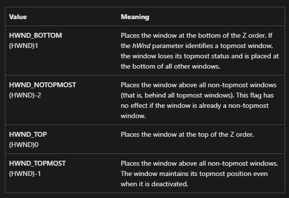  

**MGSVFix removes this flag**, ensuring borderless mode behaves as expected.

## Framerate Unlock  

MGSVFix includes an **option to unlock the framerate**. This replicates the effect of modifying [`TPP_GRAPHICS_CONFIG`](https://www.pcgamingwiki.com/wiki/Metal_Gear_Solid_V:_The_Phantom_Pain#High_frame_rate) and setting `framerate_control` to `Variable`.  

While this works well in *The Phantom Pain*, it introduces physics issues in *Ground Zeroes*.  
 
At higher framerates (above ~75 FPS), **throwables like magazines or grenades freeze in mid-air**, as shown in this clip:  

[groundzeroes_throwable_before.mp4](.github/images/groundzeroes_throwable_before.mp4)

MGSVFix **corrects this issue**, allowing throwables to work properly regardless of framerate.  

[groundzeroes_throwable_after.mp4](.github/images/groundzeroes_throwable_after.mp4)

---

# The Phantom Pain

Each issue listed below is addressed by MGSVFix.

### Unlock Resolutions

Both *The Phantom Pain* and *Ground Zeroes* only support resolutions that are 16:9 or 16:10. MGSVFix removes this restriction and allows the game to display all available resolutions.

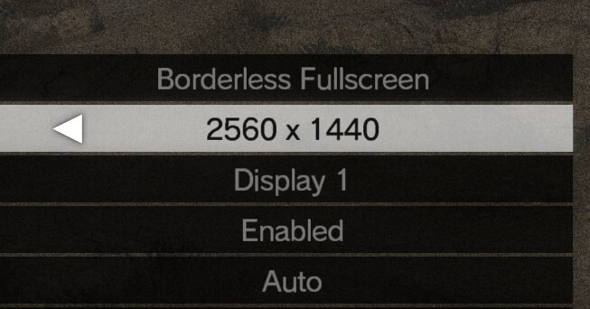

## Ultrawide

### Depth of Field

Depth of field is exaggerated at ultrawide resolutions. This can be a little hard to see in a static comparison, and is much easier to see in motion.

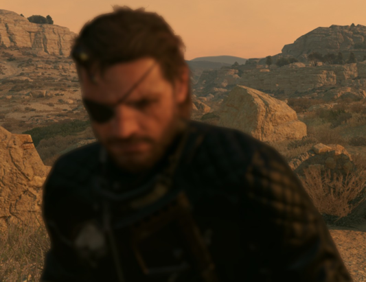

### Lens Flares/Effects

At ultrawide resolutions lens flares are exaggerated and over-sized.

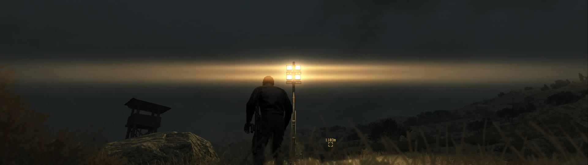

This is especially noticable in the opening of *Ground Zeroes*.

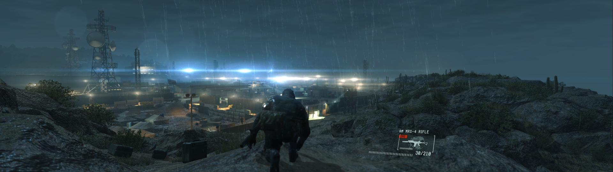

### Overlays

Several overlays, such as the one shown when using the sonar, are scaled incorrectly.

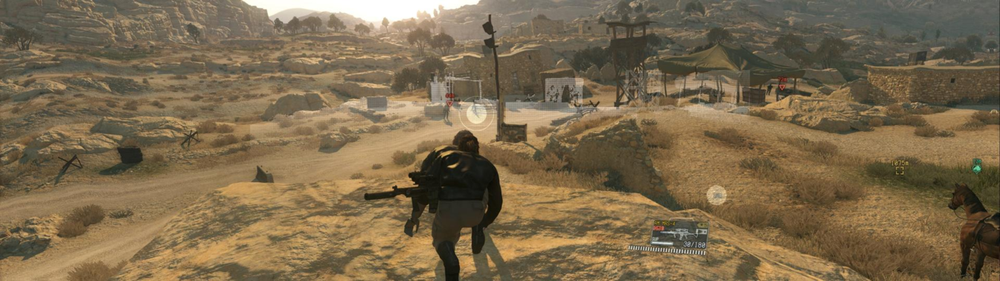

### Sonar Markers

Markers that show up after using the sonar are misaligned and incorrectly placed.

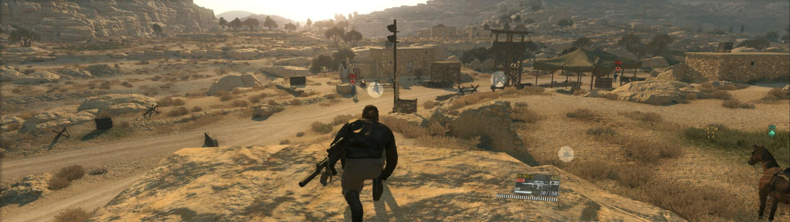

### Throwable Marker

When readying a throwable, the destination marker is scaled incorrectly.

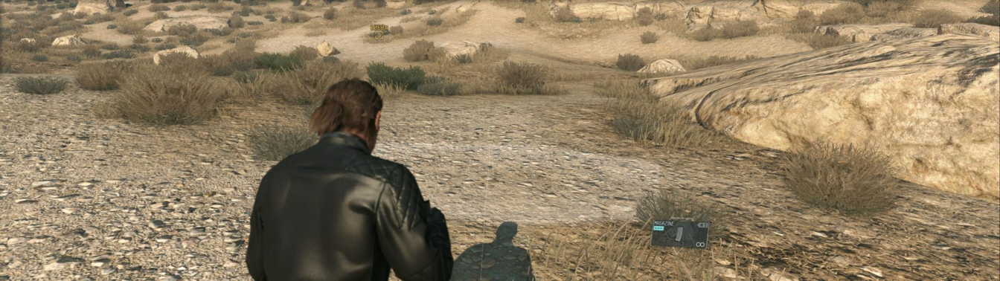

### Markers

Markers are misaligned and incorrectly placed.

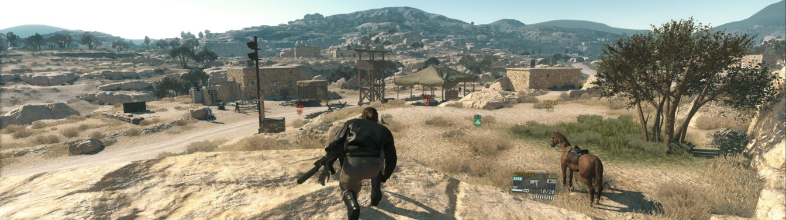

### Scope

When using scopes the frame does not span the screen. MGSVFix partially addresses this issue by stretching the frame to span the screen.

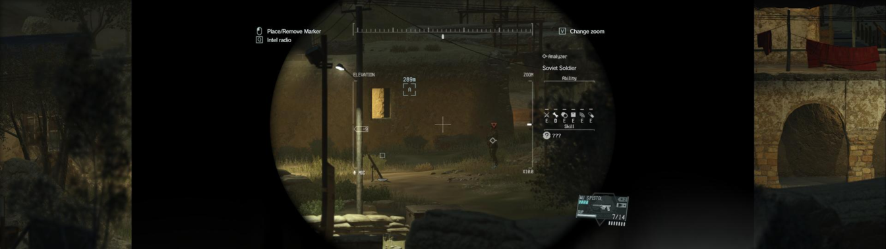

### Backgrounds

Several menu backgrounds do not span to fill the screen.

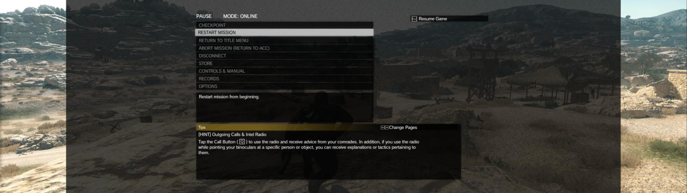

### Movies

While FMV sections in *The Phantom Pain* are pretty rare, they display incorrectly at ultrawide resolutions. The video itself is stretched to span the screen and a 16:9 video frame is then drawn over the top.

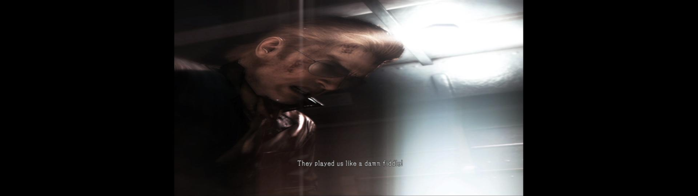

